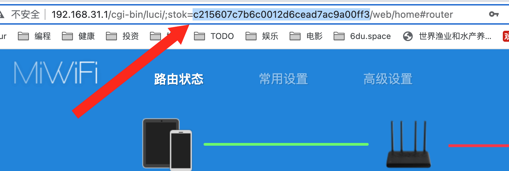

# 红米 ax6000 刷机教程

1. 登录后台 http://192.168.31.1/ 默认后台密码是无线网密码

2. 升级到指定版本固件 redmi-ax6000-1.2.8.bin

3. 获取 sock（登陆小米路由器后台后，浏览器地址栏 stok= 后面的一段内容即是）
   

4. 打开浏览器，复制下面的内容到地址栏，并替换下面的{token}为 stok

```
http://192.168.31.1/cgi-bin/luci/;stok={token}/api/misystem/set_sys_time?timezone=%20%27%20%3B%20zz%3D%24%28dd%20if%3D%2Fdev%2Fzero%20bs%3D1%20count%3D2%202%3E%2Fdev%2Fnull%29%20%3B%20printf%20%27%A5%5A%25c%25c%27%20%24zz%20%24zz%20%7C%20mtd%20write%20-%20crash%20%3B%20
```


如果显示 {"code":0} 如上返回内容则表示成功

然后重新打开 http://192.168.31.1

通过浏览器执行完这一步路由器会重启，等待重启完成（注意，电脑会自动连上其他网络，需要手工切换回来）。

5. 重启完成后打开路由器后台（注意：路由器重启你需要重新登陆获取下新的 stok ），然后同样打开浏览器，复制下面的内容到地址栏，并替换 {STOK} 。

```
http://192.168.31.1/cgi-bin/luci/;stok={token}/api/misystem/set_sys_time?timezone=%20%27%20%3B%20bdata%20set%20telnet_en%3D1%20%3B%20bdata%20set%20ssh_en%3D1%20%3B%20bdata%20set%20uart_en%3D1%20%3B%20bdata%20commit%20%3B%20
```

如果显示 {"code":0} 如上返回内容则表示成功

然后再粘贴 (记得替换 token)

```
http://192.168.31.1/cgi-bin/luci/;stok={token}/api/misystem/set_sys_time?timezone=%20%27%20%3b%20reboot%20%3b%20
```

通过浏览器执行完这一步路由器会重启，等待重启完成（注意，电脑会自动连上其他网络，需要手工切换回来）。

6. 永久开启并固化 ssh

先 `telnet 192.168.31.1`

```
echo -e 'gooutgfw\ngooutgfw' | passwd root
nvram set ssh_en=1
nvram set telnet_en=1
nvram set uart_en=1
nvram set boot_wait=on
nvram commit
sed -i 's/channel=.*/channel="debug"/g' /etc/init.d/dropbear
/etc/init.d/dropbear restart
mkdir /data/auto_ssh
cd /data/auto_ssh

cat > auto_ssh.sh << EOF
#!/bin/sh
host_key=/etc/dropbear/dropbear_rsa_host_key
host_key_bk=/data/auto_ssh/dropbear_rsa_host_key
if [ -f \$host_key_bk ]; then
    ln -sf \$host_key_bk \$host_key
fi

channel=\`/sbin/uci get /usr/share/xiaoqiang/xiaoqiang_version.version.CHANNEL\`
if [ "\$channel" = "release" ]; then
    sed -i 's/channel=.*/channel="debug"/g' /etc/init.d/dropbear
    /etc/init.d/dropbear restart
fi
if [ ! -s \$host_key_bk ]; then
    i=0
    while [ \$i -le 30 ]
    do
        if [ -s \$host_key ]; then
            cp -f \$host_key \$host_key_bk 2>/dev/null
            break
        fi
        let i++
        sleep 1s
    done
fi
EOF

chmod +x auto_ssh.sh
uci set firewall.auto_ssh=include
uci set firewall.auto_ssh.type='script'
uci set firewall.auto_ssh.path='/data/auto_ssh/auto_ssh.sh'
uci set firewall.auto_ssh.enabled='1'
uci commit firewall
uci set system.@system[0].timezone='CST-8'
uci set system.@system[0].webtimezone='CST-8'
uci set system.@system[0].timezoneindex='2.84'
uci commit
mtd erase crash
reboot
```

复制上面的命令到 termius 终端里执行

这会设置 ssh root 用户的密码为 gooutgfw 
并永久开启 SSH、并从开发模式修改回正常的模式，并重启。

等待重启完成后就能连上 ssh 了。

如果重置了路由器，密码会回复为默认密码。

可以通过 [SN 密码计算器](./SN.zip) 获取默认 root 账号的密码（SN 码在路由器底部或路由器管理页面能查看到）


7. 安装 clash

通过 SSH 连接上小米 AX6000 执行安装下面的命令（请不要使用 telnet 连接安装 ShellClash，否则会乱码）

```
export url='https://raw.fastgit.org/juewuy/ShellClash/master' && sh -c "$(curl -kfsSl $url/install.sh)" && source /etc/profile &> /dev/null
```

所有问题都输入 1

安装后输入 clash ，配置参考下图


然后设置定期更新重启


访问 http:// 路由器 ip:9999/ui/#/proxies 可以进行 clash 管理

## 爱快配置

设置 Lan1 ip 地址为 192.168.31.3


小米路由器设置如下

先修改 IP 地址为 192.168.3.1


然后修改 DHCP 默认网关为 192.168.3.1

接下来访问 http://192.168.3.1

上网设置如下，其中 192.168.31.3 是在爱快中设置的 IP


可能需要重新装一下面板，以刷新后台 ip, 重新装面板如下图


配置CN IP不走代理


## 参考教程

1. [刷机视频步骤](https://www.youtube.com/watch?v=AkBrLBjpc_k)
